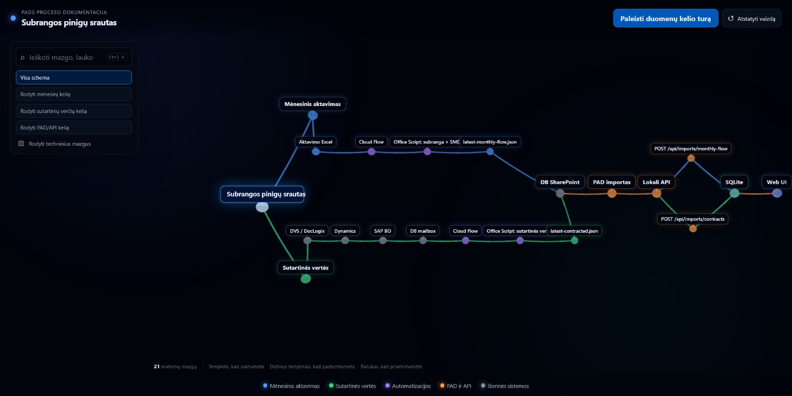

# PADS MoneyFlow

Vidinė įmonės LAN programa subrangovų mėnesiniams pinigų srautams stebėti.

[](https://lukosius99.github.io/Subcontractor-money-flow/subrangos-duomenu-kelias-3d/)

[Atidaryti interaktyvią GitHub Pages duomenų kelio schemą](https://lukosius99.github.io/Subcontractor-money-flow/subrangos-duomenu-kelias-3d/)

## Įdiegimas naujame Windows 11 kompiuteryje

1. Prisijunkite prie privataus GitHub repo ir pasirinkite **Code → Download ZIP**.
2. Išskleiskite visą ZIP failą, pavyzdžiui, į `C:\Temp\Subcontractor-money-flow`. Scenarijaus neleiskite tiesiai iš ZIP lango.
3. Įdiekite [.NET 10 SDK](https://dotnet.microsoft.com/download/dotnet/10.0), jei jo nėra.
4. Išskleistame aplanke dešiniuoju pelės mygtuku spauskite `Deploy-MoneyFlow.ps1` ir pasirinkite **Run with PowerShell**. Patvirtinkite administratoriaus teisių langą.
5. Įveskite PAD / Cloud Flow importo API raktą. Jo neviešinkite ir neįrašykite į repo.
6. Palaukite pranešimo **DIEGIMAS BAIGTAS SĖKMINGAI**.
7. Serveryje atidarykite [http://localhost:5000](http://localhost:5000).

Jei Windows nerodo **Run with PowerShell**, atidarykite PowerShell tame aplanke ir vykdykite:

```powershell
powershell -ExecutionPolicy Bypass -File .\Deploy-MoneyFlow.ps1
```

Iš kito įmonės LAN kompiuterio atidarykite diegimo pabaigoje parodytą adresą, pavyzdžiui, `http://SERVERIO-VARDAS:5000` arba `http://192.168.1.25:5000`.

## Duomenys ir saugus atnaujinimas

- Gyva DB: `C:\ProgramData\PADS\MoneyFlow\monthly-money-flow.db`.
- Repo pradinė kopija: `seed\monthly-money-flow.db`. Ji turi dabartinius importuotus duomenis ir yra sąmoningai laikoma tik privačiame repo.
- Pirmą kartą diegiant seed DB automatiškai nukopijuojama į `ProgramData`.
- Diegiant atnaujinimą esama gyva DB neliečiama. Atsisiųskite naują ZIP, išskleiskite ir vėl paleiskite tą patį scenarijų.
- Tyčia pakeisti gyvą DB seed kopija galima tik administratoriaus PowerShell komanda žemiau. Prieš pakeitimą automatiškai sukuriama kopija `Backups` aplanke.

```powershell
.\Deploy-MoneyFlow.ps1 -ReplaceDatabase
```

Niekada netrinkite `C:\ProgramData\PADS\MoneyFlow` ir neperrašykite gyvos DB rankiniu būdu veikiančiai paslaugai.

## Paslaugos valdymas

Administratorius gali patikrinti, paleisti, sustabdyti arba perkrauti paslaugą:

```powershell
Get-Service MoneyFlow
Start-Service MoneyFlow
Stop-Service MoneyFlow
Restart-Service MoneyFlow
```

## Ką perduoti tinklo administratoriui

Programa serveryje klausosi `http://0.0.0.0:5000`. Serveriui reikia statinio LAN IP arba DHCP rezervacijos. Administratorius gali:

- nukreipti vidinį DNS vardą `ktpads.lt` į serverį ir naudoti `http://ktpads.lt:5000`; arba
- rekomenduojama: per IIS, Caddy ar Nginx publikuoti `http://ktpads.lt`, užklausas perduodant į `http://localhost:5000`.

DNS programoje nekoduojamas. HTTPS ir sertifikatą parenka tinklo administratorius. Išsamūs žingsniai bei trikčių šalinimas pateikti [DEPLOYMENT.md](DEPLOYMENT.md).

## Seed DB atnaujinimas

Administratoriaus PowerShell lange, kai norite į privatų repo įdėti naują dabartinės gyvos DB kopiją:

```powershell
.\Update-SeedDatabase.ps1
```

Scenarijus saugiai sustabdo ir vėl paleidžia `MoneyFlow`, nekopijuoja SQLite laikinųjų failų, o radęs `sqlite3.exe` atlieka vientisumo patikrą. DB turi realius įmonės duomenis — repo privalo likti privatus.
